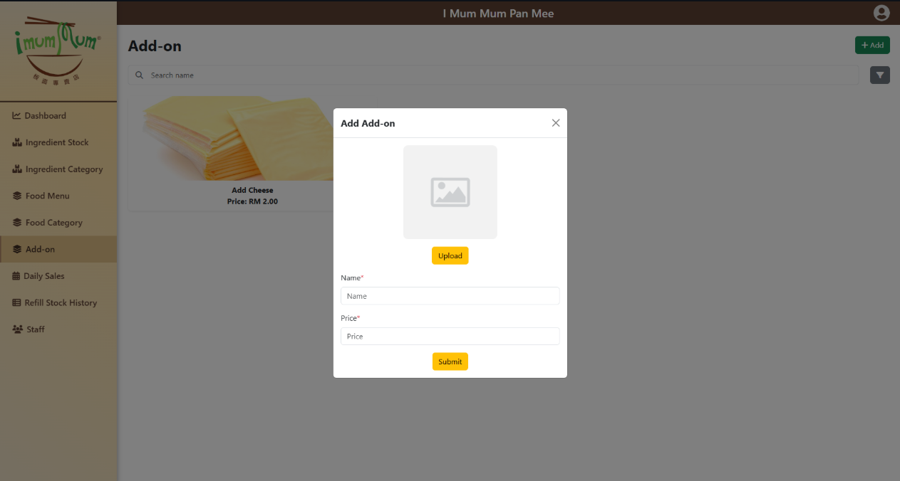

# Restaurant Ingredient Inventory System (RIIS)

## Introduction
The **Restaurant Ingredient Inventory System (RIIS)** is a web-based platform designed to help restaurants and small businesses automate and streamline their inventory management processes.  
Traditionally, many businesses still rely on physical records or spreadsheets to track ingredients, which often leads to data duplication, loss, human error, and inefficient stock handling. RIIS addresses these challenges by providing a secure, reliable, and user-friendly system that manages ingredients, suppliers, categories, and purchase records in real time.  

By integrating automation and digital tracking, RIIS reduces paperwork, minimizes stock miscounts, provides timely low-stock alerts, and ensures centralized data access — all while saving valuable time during daily operations.

### Group Members
- Chin Chun Teng  
- Dennis Lim Wei Yao  
- Wong Yih Jyi  

## Scope
- **Super Admin:**  
  - The Super Admin has full control over the system, including the ability to manage all users such as staff and admins by adding, editing, or removing their accounts.

- **Admin:**  
  - Check current ingredient status, Suggest restocking ingredient, Access basic inventory insights and upload daily sale.

---

RIIS is a modern solution that bridges the gap between manual inventory tracking and digital automation, ensuring efficiency, accuracy, and scalability for growing restaurants.

---

# RIIS — Step-by-Step User Guide

👉 **Access the system:** [Go to Login Page](https://foodventory.synergy-college.org/)

---

## 1) Log In
1. Open the login page.
2. Enter your **email** and **password**.
3. Click **Login** to go to the **Dashboard**.  
4. Forgot your password? Click **Forgot Password**, enter your email, and complete email verification to reset.
5. Default password and email will be superadmin@gmail.com and 123456 for superadmin
6. Default Admin email address and password : admin@gmail.com and 123456
---

## 2) Understand the Dashboard
The Dashboard shows your key stats and quick links:
- **Monthly Revenue**
- **Total Refill Amount**
- **Low Stock Items**
- **Last Daily Sales Upload**
- Charts: **Top 10 Ingredient Consumption (Monthly)** and **Sales Trend (Last 7 Days)**
- **Low-stock ingredient list** at the bottom  

Use the left **sidebar** to navigate: Ingredients, Categories, Menu (Foods & Add-ons), Daily Sales, Refill History, and Staff.

---
## 3) First-Time Setup (Super Admin)
Do these once before daily operations:

### A. Create Ingredient Categories

1. Sidebar → **Ingredients → Categories**

2. Click **Add Category**, name it, and **Save**

### B. Add Ingredients

1. Sidebar → **Ingredients → Stock List**
2. Click **Add Ingredient**

3. Fill in: **Category**, **Name**, **Unit Type** (weight/quantity), **Stock**, **Minimum Stock**, **Unit per Weight** (needed), **Price**
4. **Save**  

### C. Create Food Categories

1. Sidebar → **Menu → Food Categories**

2. Click **Add Category**, name it, and **Save**

### D. Add Foods (Menu Items) & Link Ingredients

1. Sidebar → **Menu → Foods**

2. Click **Add Food** and enter **Category**, **Name**, **Price**, **Description**

3. Open the **Food Detail** page
4. Click **Manage Ingredients** → **Add Ingredient**, select items, set **consumption per unit**, and **Save**

### E. Add Add-ons (Optional)

1. Sidebar → **Menu → Add-ons**

2. Click **Add Add-on**, set **name/price**

3. Add ingredients consumed by the add-on

### F. Add Staff

1. Sidebar → **Staff**

2. Click **Add Staff**, fill in details, choose role (**Admin** or **Super Admin**), and **Save**

---

## 4) Daily Operations (Admin / Super Admin)

### A. Record Daily Sales

1. Sidebar → **Daily Sales** → **Add New**

2. For each **Food** and **Add-on**, enter the **quantity sold** 
3. Totals (quantity and amount) calculate automatically 
4. Review the **Ingredient Consumption Preview**:
   - See **Current Stock**, **Consumption**, **Remaining Stock**, **Cost (RM)**
   - Adjust if stock goes negative 
5. Click **Submit** to save the record 

6. Daily sales Example after submit

**To review past sales:**
- Sidebar → **Daily Sales**

- Filter by **Date** or **Staff**, click **Apply** (use **Reset** to clear)

### B. Refill Stock
**Option 1 — from Stock List**

1. Sidebar → **Ingredients → Stock List**
2. Click **Refill** next to an ingredient

3. Choose the ingredient then Enter the **quantity/weight** received, then **Save**, then it will be refill click on the ingredient card to show the datetime and who refill it , quantity , quantity , weight amount.

### C. View Refill History

1. Sidebar → **Refill History**

2. Filter by **Start Date**, **End Date (optional)**, **Staff**, **Ingredient**
3. Click **Apply** or **Reset**

### D. Monitor Low Stock
- Dashboard → check **Low Stock Items** KPI and **low-stock list**
- Click an ingredient to plan refills

---

## 5) Category & Menu Maintenance

### A. Manage Ingredient Categories
- Sidebar → **Ingredients → Categories**

- This page provides **Search** and **Add** functions.  
To **Edit** or **Delete** a category, you need to click on the **category card** first.

### B. Manage Food Categories

- Sidebar → **Menu → Food Categories**
- This page provides **Search** and **Add** functions.  
To view foods in a category, click on the **category card**.  
To **Edit** or **Delete** a category, you need to click on the **category card** first.

### C. Update Foods & Recipes
- Sidebar → **Menu → Foods** → select a food

- On **Food Detail**, edit details or manage linked ingredients

### D. Manage Add-ons
- Sidebar → **Menu → Add-ons**
- Edit/Delete add-ons and ingredient usage

---

## 6) Staff & Account

### A. Staff Management (Super Admin)
1. Sidebar → **Staff**
2. **Search/Filter** staff; use **Add** to create accounts

3. Open **Staff Detail** to **Change Password** or **Edit** the account user role

### B. Your Account
1. Sidebar → **Account → Profile**

2. Click **Edit Profile** to upload image, change **name/email/password**, then **Submit**

---

## 7) Tips & Good Practices
- **Record daily sales before closing** so dashboards and stock stay accurate
- Set **Minimum Stock** properly to trigger **Low-stock alerts**
- Keep recipes updated for correct **Ingredient Consumption Preview**
- Use **Refill History filters** for audits
- If charts show *No data*, make sure **Daily Sales** are entered

